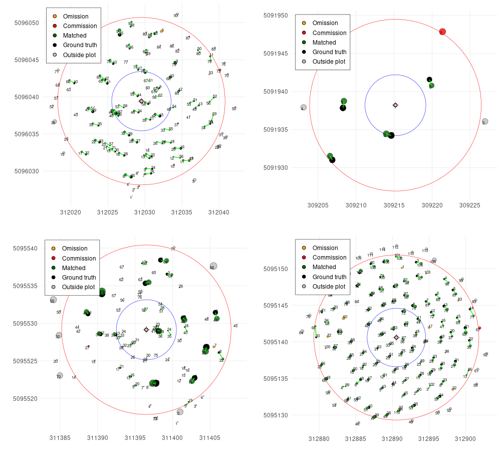

# TreeMatching

**TreeMatching** is an R package that provides tools for matching trees between two spatial datasets, typically lidar-derived tree segmentations and field-measured datasets.

Matching trees between different surveys (e.g., lidar-derived and field-measured) is challenging due to non-rigid and local misalignments. This package introduces robust approaches and 3D strategies, where X and Y come from the spatial coordinates and Z is synthesized from tree DBH or tree height to improve the quality of the matching.

The current version includes two matching strategies:

- Solving Linear Sum Assignment Problem ([Hungarian algorithm](https://en.wikipedia.org/wiki/Hungarian_algorithm)) (**preferred method**)
- Bidirectional 2-nearest-neighbors 3D matching (**experimental**)

Read the [tutorial 📖](https://r-lidar.github.io/TreeMatching/articles/Tutorial.html)

## Example

```r
library(TreeMatching)

data(PRF025_Field)
data(PRF025_Lidar)
PRF025_Field <- standardize(PRF025_Field, "Field_Xpj", "Field_Ypj", "DBH", dbhunits = "cm", crs = 2959)
PRF025_Lidar <- standardize(PRF025_Lidar, "X", "Y", "DBH", dbhunits = "m", crs = 2959)
center <- c(PRF025_Field$Easting[1], PRF025_Field$Northing[1])

treemap <- make_mapmatching(PRF025_Field, PRF025_Lidar, center, radius = 11.28)
treemap <- match_trees(treemap, method = lsap_matching, dxymax = 2, dzmax = 0.05)

plot(treemap, scale = 2)
plot(treemap, rgl = TRUE)

treemap$match_table
```




## Installation

Using package `remotes`.

```r
remotes::install_github("r-lidar/TreeMatching")
```

## Sponsor

`lidRalignment` has been sponsored by the [University of Sherbrooke](https://www.usherbrooke.ca/)


