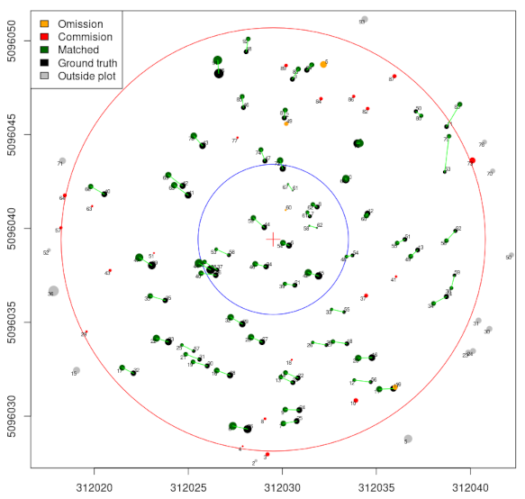
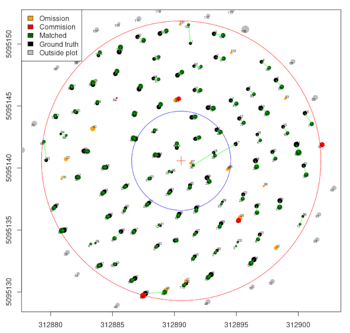

# TreeMatching

**TreeMatching** is an R package that provides tools for matching trees between two spatial datasets, typically lidar-derived tree segmentations and field-measured datasets.

Matching trees between different surveys (e.g., lidar-derived and field-measured) is challenging due to non-rigid and local misalignments. This package introduces robust approaches and 3D strategies, where X and Y come from the spatial coordinates and Z is synthesized from tree DBH or tree height to improve the quality of the matching.

The current version includes two matching strategies:

- Bidirectional 2-nearest-neighbor 3D matching  
- Linear Sum Assignment Problem solving (Hungarian method)

## Example

```r
library(TreeMatching)

data(PRF025_Field)
data(PRF025_Lidar)
PRF025_Field <- standardize(PRF025_Field, "Field_X", "Field_Y", "DBH", crs = 2959)
PRF025_Lidar <- standardize(PRF025_Lidar, "X", "Y", "DBH", crs = 2959)
center = c(PRF025_Field$Easting[1], PRF025_Field$Northing[1])

treemap <- make_mapmatching(PRF025_Field, PRF025_Lidar, center, radius = 11.28)
treemap <- match_trees(treemap, method = lasap_matching, dmax = 2, dz = 0.1)

plot(treemap, scale = 2)
plot(treemap, rgl = TRUE)

treemap$matching_table
```





## Installation

```r
# From GitHub (requires remotes)
remotes::install_github("r-lidar-lab/TreeMatching")
```
