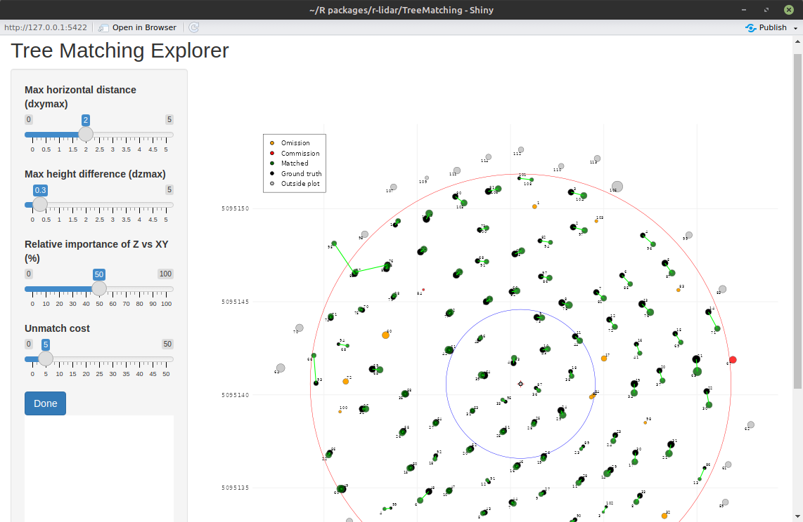

```{r, include = FALSE}
knitr::opts_chunk$set(
  collapse = TRUE,
  comment = "#>"
)
```

## Introduction

`TreeMatching` matches trees from a LiDAR dataset (either ALS or TLS) to trees in an inventory dataset by solving a [Linear Sum Assignment Problem (LSAP)](https://en.wikipedia.org/wiki/Assignment_problem) in 3D space. The X and Y dimensions represent the tree positions (a positional matching), while the third Z dimension is artificially created using either DBH (for TLS) or tree height (for ALS). This synthetic Z-dimension improves the accuracy of the matching and helps avoid false positives.

The package uses the [Hungarian algorithm](https://en.wikipedia.org/wiki/Hungarian_algorithm), which always finds the optimal solution to the LSAP. This guarantees the best possible matching with the lowest total cost, based on a given cost matrix. However, **the real challenge is to define a good cost function**, one that leads to meaningful and accurate matches between trees.

In this tutorial, we explain how `TreeMatching` works and how its parameters influence the results.

## Prepare data

First let load the example data


```{r}
library(TreeMatching)
data(PRF025_Field)
data(PRF025_Lidar)
```

The user's data can come in any format, with various naming conventions and unit standards. Therefore, to ensure everything works correctly, we first need to standardize the data by specifying which columns contain the X and Y coordinates, as well as the DBH (or tree height), what are the units and so on.

```{r}
PRF025_Field <- standardize(PRF025_Field, "Field_Xpj", "Field_Ypj", "DBH", "cm", crs = 2959, idname = "Tree")
PRF025_Lidar <- standardize(PRF025_Lidar, "X", "Y", "DBH", "m", crs = 2959, idname = "treeID")
```

<!-- extra‑info box -->
<div style="
     border-left: 4px solid #1c90f3;
     background:   #e7f4ff;
     padding:      0.75em 1em;
     margin:       1em 0;
     border-radius: 4px;
     ">
  <p style="margin:0;">
    Register the column that records a unique ID for each tree with `idname = ...` is not mandatory. It only provides extra graphical display and by ID results.
  </p>
</div>


Next, for various reasons, the algorithm needs to know the center and size of the plot we're working with. This is mainly used to filter out trees that fall outside the plot boundaries and plot graphics. In this specific dataset, the center of the plot is already stored and repeated in the `Easting` and `Northing` columns. We now use this information to create the `TreeMap` object that we'll be working with in the following steps.

```{r, fig.width=6, fig.height=6}
center <- c(PRF025_Field$Easting[1], PRF025_Field$Northing[1])

tm <- make_mapmatching(PRF025_Field, PRF025_Lidar, center, radius = 11.28)
plot(tm, scale = 2, gg = TRUE)
```

## Linear Sum Assignment Problem

Now let's apply tree matching using LSAP. By default, the Hungarian algorithm matches all possible pairs and finds the combination with the lowest total cost. We haven't yet explained how the matching cost is computed, we'll get to that later but, for now, let's set that aside and look at what the Hungarian algorithm does when no constraints are applied.

```{r, fig.width=6, fig.height=6}
tm <- match_trees(tm, dxymax = 10000, dzmax = 10000, zrel = 40, unmatch_cost = 10000)
plot(tm, scale = 2, gg = TRUE)
```

In this dataset, the results are not terrible, **it could be much worse**, but we can see that some irrelevant trees are matched. This happens because the algorithm is trying to minimize the cost of matching every tree in the inventory with a tree in the LiDAR data, whether it makes sense or not.

However, in real-world forest inventories, it's common to have omissions (missing trees) and commissions (extra trees). The standard LSAP solver does not support these cases by default.

To overcome these limits, we can introduce dummy trees, and assign a constant cost to matching a real tree with a dummy one. This is exactly what the `unmatch_cost` parameter does. For example, if we set `unmatch_cost = 10000`, it means that matching a tree with a dummy is very expensive, so the algorithm will avoid it unless absolutely necessary.

Now let's try using a very low value, like `unmatch_cost = 0.7`. In this case, most trees are **not matched**. That's because it's cheaper for the algorithm to leave a tree unmatched than making an correct match.

```{r, fig.width=6, fig.height=6}
tm <- match_trees(tm, dxymax = 1000, dzmax = 1000, zrel = 40, unmatch_cost = 0.7)
plot(tm, scale = 2, gg = TRUE)
```

## Parameter selection

Let's try now with a more reasonable value (we'll discuss how to choose a good value later in the tutorial). Here we are using `unmatch_cost = 3`

```{r, fig.width=6, fig.height=6}
tm <- match_trees(tm, dxymax = 1000, dzmax = 1000, zrel = 40, unmatch_cost = 3)
plot(tm, scale = 2, gg = TRUE)
```

The results are much better!! Let's now tune a few other parameters.

### `dxymax` and `dzmax`

- `dxymax` sets the maximum horizontal (XY) distance allowed between two matched trees. If two trees are farther apart than this value, their matching cost is set to infinity, meaning they cannot be matched.
- `dzmax` sets the maximum vertical (Z) distance allowed. In order to work both with ALS using tree height and TLS using DBH this parameters is expressed in percent. In this tutorial, the Z value is based on DBH, so `dzmax = 30` means a 30% difference is allowed between the DBH of the ground inventory and the DBH measured with the lidar. For example, a tree measured in the field at 14 cm DBH cannot be matched with a LiDAR tree measured at 7 cm DBH (50% difference), the cost would be infinite.

After setting reasonable values for these two parameters, the matching results now look much better.


```{r, fig.width=6, fig.height=6}
tm <- match_trees(tm, dxymax = 2, dzmax = 30, zrel = 40, unmatch_cost = 3)
plot(tm, scale = 2, gg = TRUE)
```

### `zrel`: weight of the Z Dimension

One parameter remains to be explained: `zrel`. To understand it, we first need to explain how the matching cost is computed.

By default, the matching cost is simply the 3D distance between two trees, where Z is the DBH or the tree height. However, DBH and XY positions are not directly comparable, and calculating the 3D distance naively may give too much or too little weight to Z.

To solve this, the Z dimension is scaled so that XY and Z are on a similar scale and can be compared. But this equal scaling isn't always ideal: sometimes DBH or height may dominate the match inappropriately.

That's where `zrel` comes in. It lets you control the weight of Z (DBH or height) relative to XY. A value of 0 means Z has no weight, matching is based only on XY distance, pretty much like a k-nearest-neighbors (k-NN) search. This often causes incorrect matches, such as pairing a large tree with a nearby smaller one (if we have no constraint the Z difference) as seen below.

```{r, fig.width=6, fig.height=6}
tm <- match_trees(tm, dxymax = 2, dzmax = 100, zrel = 0, unmatch_cost = 3)
plot(tm, scale = 2, gg = TRUE)
```

A value of infinity (or a very large number) gives no weight to XY, and matching is done entirely on DBH, also usually a very very bad idea. In practice, because we also have limits (`dxymax` and `dzmax`) that restrict which trees can be paired, the effect of `zrel` is limited within reasonable ranges. Below a pure DBH matching:

```{r, fig.width=6, fig.height=6}
tm <- match_trees(tm, dxymax = 10000, dzmax = 10000, zrel = 100000, unmatch_cost = 10000)
plot(tm, scale = 2, gg = TRUE)
```

Consequently, the matching process depends on two types of parameters:

- **Settings** `dxymax` and `dzmax`: These should be set to reasonable values to constrain the algorithm and avoid obviously incorrect matches.
- **Parameters** `zrel` and `unmatch_cost`: These control the matching behavior more subtly.

The `zrel` parameter is not critical, but fine-tuning it can improve a few edge-case matches. The default value is 40% weight for Z compared to XY, and values between 30 and 80% are generally reasonable. At `zrel = 100`, XY and Z contribute equally to the matching cost.

On the other hand, `unmatch_cost` is a very important parameter. It should be lower than the cost of a bad match, to avoid forcing incorrect pairings but higher than the cost of a good match, to prevent skipping valid matches.

<div style="
     border-left: 4px solid #1c90f3;
     background:   #e7f4ff;
     padding:      0.75em 1em;
     margin:       1em 0;
     border-radius: 4px;
     ">
  <p style="margin:0;">
Finding the right `unmatch_cost` value can be challenging. If the user does not specify it, the algorithm uses a simple heuristic to estimate a reasonable default.
  </p>
</div>


```{r, fig.width=6, fig.height=6}
tm <- match_trees(tm, dxymax = 2, dzmax = 30, zrel = 40)
plot(tm, scale = 2, gg = TRUE)
```

## Shiny App

A Shiny app is also available to help users interactively explore the matching parameters. It provides sliders and input fields to easily test different values and find the settings that work best for your dataset.

This visual interface is especially useful for beginners, as it allows you to:

- Adjust parameters like `dxymax`, `dzmax`, `zrel`, and `unmatch_cost` with sliders
- Instantly see how changes affect the matching results
- Experiment without writing code

This makes it much easier to understand the impact of each parameter and to fine-tune your matching process.

```r
tm = lsap_app(tm)
```

{width=100%}

## Score and matching table

After applying `match_tree` the `TreeMapMatching` object contains the matching table as well a some standard matching score. True Positive (TP), False Negative (FN), False Positive (FP), precision, recall and F-score.

```{r}
mt = tm$match_table
scores = tm$scores
print(tm)
head(mt)
```

With the matching table the user can compare individual tree attribute from the original data.

```{r, fig.show="hold", fig.width=4, fig.height=4.5}
true_positive = na.omit(tm$match_table)
dbh_inventory = tm$inventory[true_positive$index_inventory,]$DBH 
dbh_measured  = tm$measure[true_positive$index_measure,]$DBH * 100 
plot(dbh_inventory, dbh_measured, asp = 1, pch = 3,
     xlab = "Ground thruth DBH (cm)",
     ylab = "Lidar measured DBH (cm)")
abline(0,1, lty = 3)

height_inventory = tm$inventory[true_positive$index_inventory,]$Ht 
height_measured  = tm$measure[true_positive$index_measure,]$TH
plot(height_inventory, height_measured, asp = 1, pch = 3,
     xlab = "Ground thruth height (m)",
     ylab = "Lidar measured height (m)")
abline(0,1, lty = 3)
```
